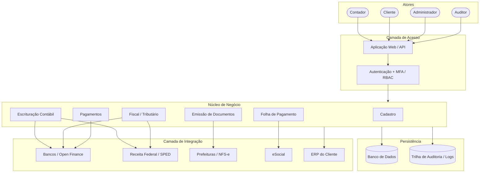
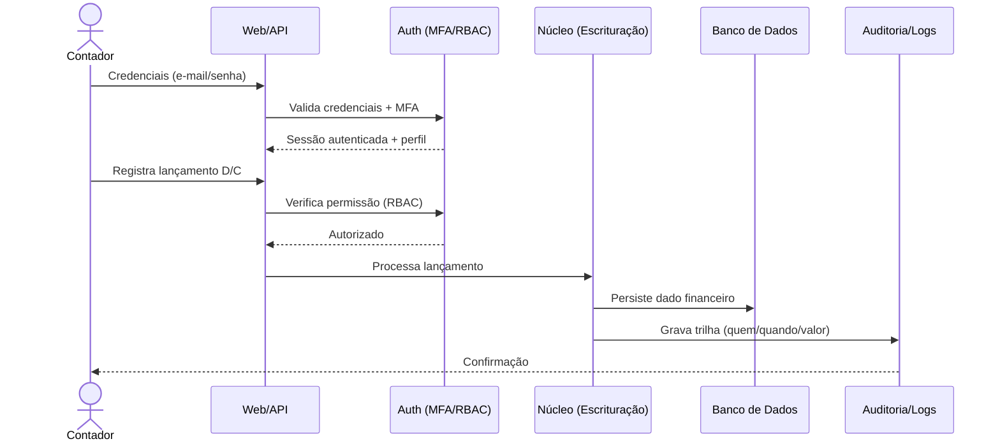
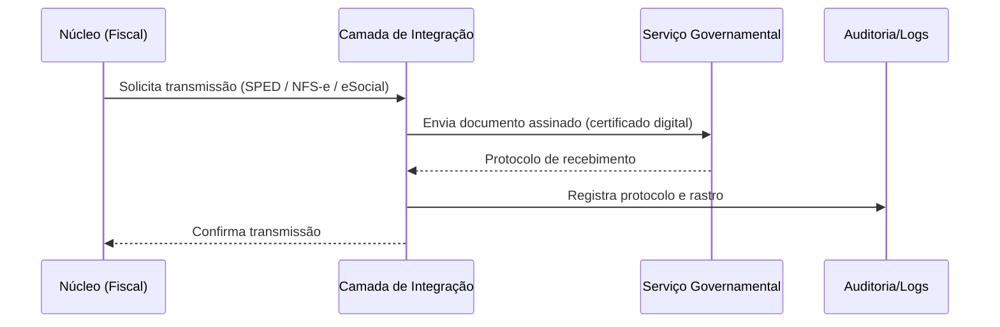

# 4. Visão Geral da Arquitetura e Fluxo

Arquitetura em camadas: clientes acessam o sistema por uma aplicação web/API,
protegida por autenticação (login + MFA) e autorização por perfil (RBAC). O
núcleo concentra os módulos de negócio, que persistem dados sensíveis e se
comunicam com serviços governamentais e bancários através de uma camada de
integração.

## 4.1 Arquitetura de alto nível

## 4.2 Fluxo típico — do login ao lançamento auditado

## 4.3 Fluxo típico — integração externa (transmissão fiscal)

> **Nota de segurança:** os pontos de maior exposição STRIDE concentram-se em
> três fronteiras — a **Camada de Acesso** (Spoofing/Elevation), a **Persistência
> e Trilha de Auditoria** (Tampering/Repudiation) e a **Camada de Integração**
> (Spoofing/Information Disclosure/Denial of Service). O detalhamento por caso de
> uso está no README e nos entregáveis do item 5.
